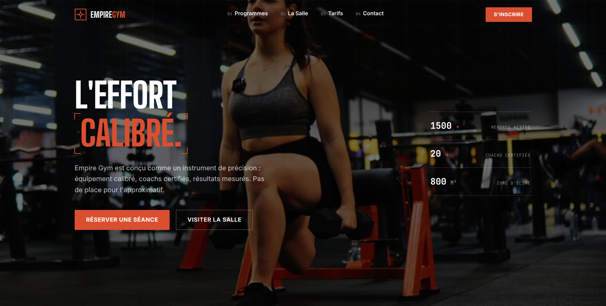

# Empire Gym — Elite Fitness Center

A premium fitness center website. Built with HTML, CSS and JavaScript, featuring GSAP animations, scroll-triggered reveals, a modern interface and a fully responsive navigation.

---

## Features

- **Cinematic intro** : preloader with letter-by-letter logo reveal and curtain transition
- **GSAP animations** : timeline for hero entrance, text effects and animated badges
- **ScrollTrigger** : scroll-based reveals across all sections (programs, the gym, pricing, testimonials)
- **Animated counters** : key statistics that increment on scroll (members, coaches, floor area)
- **Background video** : autoplay loop in the hero section
- **Mobile menu** : responsive navigation with burger menu and integrated sign-up button
- **Interactive forms** : CTA form with user feedback
- **Visual effects** : decorative corners, grid background, badges, industrial/technical style
- **Fully responsive** : breakpoints for tablet and mobile

---

## Technologies Used

- **HTML5** – Semantic and accessible structure
- **CSS3** – Custom properties, Grid, Flexbox, media queries
- **JavaScript (Vanilla)** – Interactions, animations, counters, mobile menu
- **GSAP 3.12 + ScrollTrigger** – Timeline sequencing and scroll-based animations
- **Google Fonts** – Big Shoulders Display (titles), Inter (body), JetBrains Mono (technical elements)

---

## Preview

